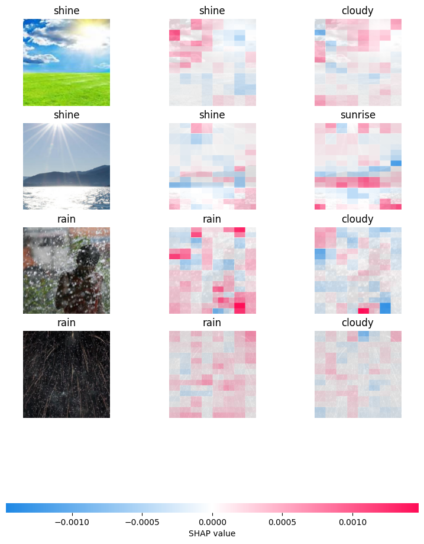

# Low Code Image Classification Model Explainability Tutorial

Welcome to the Low Code Image Classification Model Explanation Tutorial. In this tutorial, we will guide you through the process of running model explainability with SHAP.

<!-- <video width="640" height="360" controls>
  <source src="URL_TO_VIDEO.mp4" type="video/mp4">
  Your browser does not support the video tag.
</video> -->

## Getting Started

First, let's clone the repository where the project is hosted. If you already have it, we'll perform a git pull to update it:

```python
import os

# Define variables for the repository URL and directory.
REPO_URL = "https://github.com/etetteh/e.git"
REPO_DIR = "e"

# Check if the repository directory already exists.
if os.path.exists(REPO_DIR):
    # If it exists, inform the user and perform a git pull.
    print("Repository already exists. Performing git pull...")
    # Change to the repository directory.
    %cd $REPO_DIR
    # Perform a git pull to update the repository.
    !git pull
else:
    # If the repository directory doesn't exist, inform the user and clone the repository.
    print("Cloning repository...")
    # Clone the repository from the provided URL to the specified directory.
    !git clone $REPO_URL $REPO_DIR
```

Now, navigate to the image classification directory:

```python
>>> os.chdir("e/deepmindflow/image_classification/")
```

## Prerequisites

Before we begin, make sure you have the required packages and libraries installed. You can use the following command to install them:

```python
>>> !pip install -r requirements.txt
```

## Prepare the Sample Dataset

In this tutorial, we'll use a sample dataset. You can download and extract it with the following commands:

```python
>>> !wget https://prod-dcd-datasets-cache-zipfiles.s3.eu-west-1.amazonaws.com/4drtyfjtfy-1.zip -qq
>>> !unzip -q 4drtyfjtfy-1.zip
>>> !unzip -q dataset2.zip
```

Next, we'll use Python code to process the dataset. We have created a utility module to assist with this:

```python
>>> import utils

>>> # Create image subclasses and save them in a `weather` directory
>>> data_process = utils.CreateImgSubclasses("dataset2", "weather")

>>> # Get image class names
>>> classes = data_process.get_image_classes()
>>> print(sorted(classes))
['cloudy', 'rain', 'shine', 'sunrise']
```

Now split the dataset into train, validation and test sets.

```python
>>> # Create subdirectories for each image class
>>> class_dirs = data_process.create_class_dirs(classes)

>>> # Copy images to their respective subdirectories
>>> weather_data = data_process.copy_images_to_dirs()

>>> # Create train, validation, and test dataset splits
>>> utils.create_train_val_test_splits(img_src="weather", img_dest="weather_data", ratio=(0.8, 0.10, 0.1))
```

## Cleaning Up

After dataset processing, you can remove unnecessary data:

```python
>>> !rm -rf weather 4drtyfjtfy-1.zip* dataset2*
```

## Model Explainability to Understand Prediction Decision

After training, the decision-making power of a model can be analyzed to understand how a particular label was assigned to its corresponding image.

**Sample Command For Model Explainability**:

```python
>>> !accelerate launch \
        explain.py \
        --dataset weather_data/ \
        --model_output_dir enext/efficientvit_b1/ \
        --feat_extract \
        --n_samples 4 \
        --max_evals 3000 \
        --topk 2
```

Output after running the above command:

```bash
Model explanation complete. Result has been saved to enext/efficientvit_b1/explanation.png
```



## Additional Configuration Options

To further customize your training process, you can explore additional configuration options by running:

```python
>>> !python explain.py --help
```

With this command, you can analyze the prediction decision-making process of your trained model, helping you understand how labels are assigned to images and gain insights into model behavior. Enjoy exploring the explainability of your image classification model!
